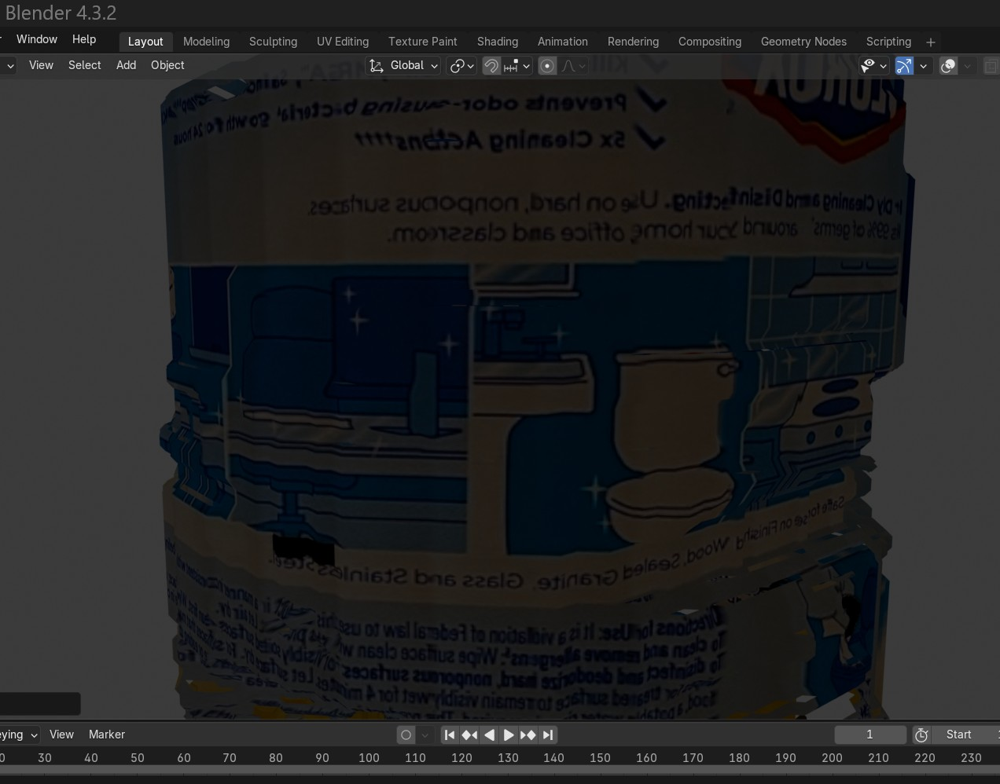

# Cylindrical Object Panorama Creator

<div align="center">
  <table>
    <tr>
      <td align="center"><b>Input Image Sample</b></td>
      <td align="center"><b>Generated Panorama Result</b></td>
    </tr>
    <tr>
      <td></td>
      <td></td>
    </tr>
  </table>
</div>

<br/>

<div align="center">
  <table>
    <tr>
      <td align="center"><b>Textured 3D Model (View 1)</b></td>
      <td align="center"><b>Textured 3D Model (View 2)</b></td>
    </tr>
    <tr>
      <td></td>
      <td></td>
    </tr>
  </table>
</div>

## Overview

This tool creates seamless panoramas from images of cylindrical objects by automatically stitching together photos taken while rotating around the object. Unlike traditional panorama tools, this project is specifically designed for cylindrical objects where distortion presents a unique challenge.

The tool uses a flexible parameter approach that adapts to the specific characteristics of each image pair, automatically finding the optimal alignment parameters for each stitch. It also supports vertical adjustments to account for camera alignment variations.

## Features

- **Object Segmentation**: Automatically extracts the object from the background using the GrabCut algorithm
- **Flexible Parameter Matching**: Tests multiple parameters for each stitch and selects the best combination
- **Vertical Offset Support**: Accounts for slight camera height variations between shots
- **Intelligent Blending**: Seamlessly combines strips to create a continuous panorama
- **Visual Hull 3D Modeling**: Reconstructs a solid mesh using silhouette fusion
- **Cylindrical Texture Mapping**: Applies panorama texture to the 3D model
- **Optional Plane Removal**: Removes flat caps like top/bottom faces for cleaner models
- **Detailed Visualizations**: Generates step-by-step visualizations of the stitching process

## Requirements

- Python 3.6+
- OpenCV 4.5+
- NumPy
- Matplotlib
- tqdm
- trimesh
- scikit-image

To install the required dependencies:

```bash
python -m pip install -r requirements.txt
```

## CLI Examples

### 1. Image Segmentation
```bash
python main.py --input_dir data/images --output_dir results --remove_planes
```

### 2. Panorama Creation, skip segmentation
```bash
python main.py --skip_segmentation --input_dir data/images --output_dir results
```

### 3. Skip segmentation & panorama
```bash
python main.py --skip_segmentation --skip_panorama --input_dir data/images --output_dir results --remove_planes
```

### 4. Plane Removal Only
```bash
# python src/modeling/plane_remover.py --input results/3d_model/visual_hull.obj --output results/3d_model/cleaned_hull.obj --threshold 0.95
```

### 5. Apply Texture Mapping
```bash
python texture_model.py --model_path results/3d_model/visual_hull.obj \
                        --panorama_path results/panorama.png \
                        --output_dir results/3d_model \
                        --remove_planes --plane_threshold 0.7
```

### All-in-One Pipeline
```bash
python main.py --input_dir data/images --output_dir results --remove_planes --plane_threshold 0.9
```

### Re-apply Texture Only
```bash
python texture_model.py --model_path results/3d_model/visual_hull.obj \
                        --panorama_path results/panorama.png \
                        --output_dir results/3d_model \
                        --texture_v_scale 1.0 --texture_v_offset 0.0
```

## Project Structure

```
cylindrical-panorama/
├── README.md                    # Project documentation
├── requirements.txt             # Dependencies
├── main.py                      # Main pipeline script
├── texture_model.py             # Re-texture standalone script
├── data/                        # Input images, segmented, panorama, models
├── results/                     # Output results
├── src/
│   ├── segmentation/            # GrabCut
│   ├── panorama/                # Stitching, strip matching
│   ├── modeling/                # Visual hull, plane remover
│   └── texturing/               # UV generation and OBJ export
└── docs/                        # Sample input and output screenshots
```

## Output Files

- `results/segmented/`: Segmented input images
- `results/panorama.png`: Final stitched panorama
- `results/3d_model/visual_hull.obj`: Raw 3D mesh from silhouettes
- `results/3d_model/textured_model/`: Final model + texture
- `results/3d_model/sample.jpg`: Screenshot of 3D result

## Limitations

- Images must be captured in order around the object (CW or CCW)
- The object should remain centered and static between shots
- Transparent or highly reflective objects may produce inconsistent results

## License

[MIT License](LICENSE)

## Acknowledgments

- Panorama stitching approach inspired by cylindrical strip-matching techniques
- Visual hull technique based on voxel carving using silhouettes
